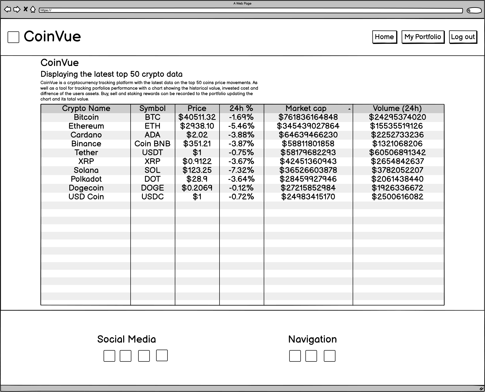
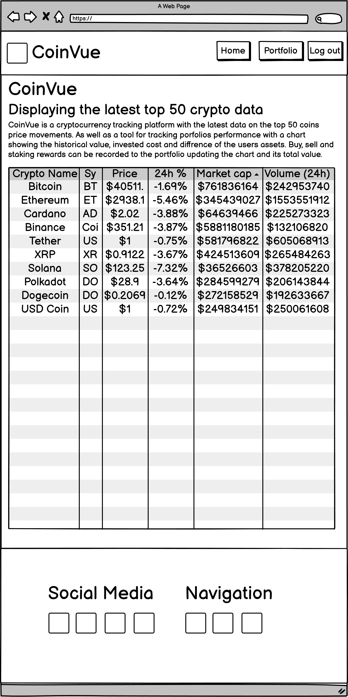
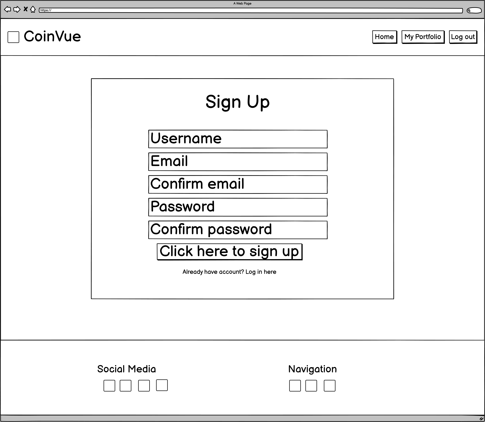
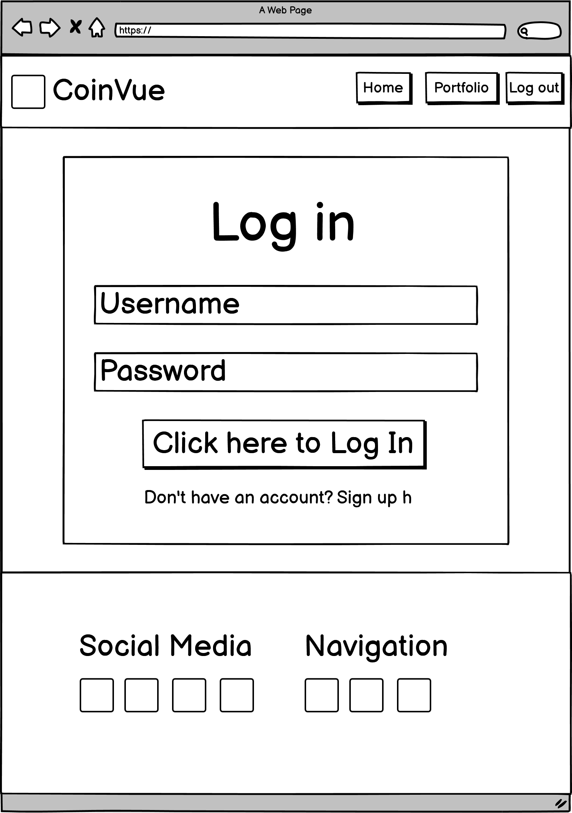
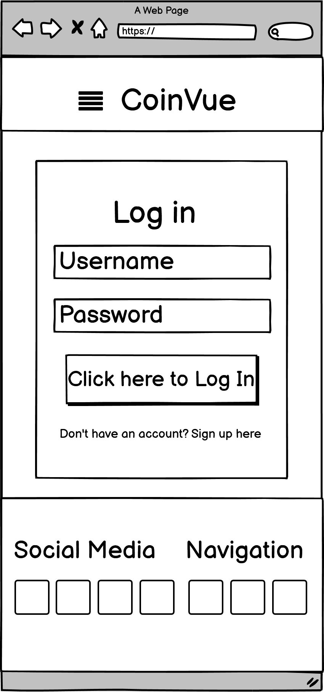
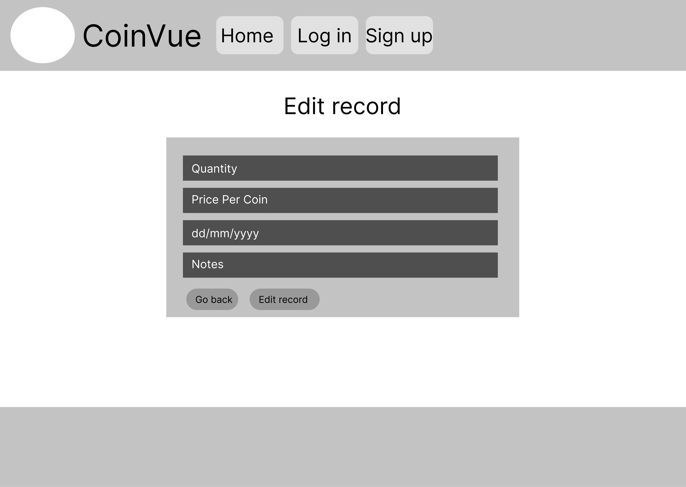

# CoinVue - Project 3

CoinVue is a cryptocurrency portfolio tracker and price tracker updating price movements to give users fast, accurate and informative data on their assets performance. The project's goal is to deliver a cryptocurrency portfolio service where users can keep track of their assets performance through buy, sell and staking records with live updates on the value of their portfolio.

## Table of contents

## 1.0 UX

### 1.1 User goals

#### 1.1.1 Target audience

CoinVue’s target audience are crypto retail investors interested in live market movements and trends broken down into easy to read data that they need to make further investments. As well as a way to track the performance of their portfolio and a place to store their records of purchases.      

### 1.2 User needs and goals

#### 1.2.1 User needs:

1. Accessibility for all users
2. Relevant updated data
3. Important data on assets
4. Sign up and log in
5. Password security 
6. Add, sell and staking rewards records
7. Portfolio charts
8. CRUD functionality

#### 1.2.2 How the user needs are met

1. All users should have equal opportunity through text transcript compatibility, color contrast that's readable, form labels, visual feedback and responsive breakpoints to support all devices
2. Fast, accurate and close to instant updated data to ensure no big price action isn't missed or inaccurate through Coinmarketcap API
3. More in depth breakdowns of individual assets when a user clicks on them such as supply, market cap, volume and price history
4. Users can sign up and log in to access and edit their portfolios with password protection 
5. To ensure account protection, users can create a password so other can log in
6. When adding records users can pick from 3 options as to add, sell and staking rewards to contribute to their portfolio
7. When 1 record is added to a portfolio the chart will update regularly to its current value
8. Users can create, read, edit and delete any of their records

### 1.3 Developer and business goals

#### 1.3.1 Goals of the business

1. To deliver an accurate service with relevant data
2. The website attracts retail investors
3. User traffic can be maintained and grow through sign ups
4. Users will interact and record transactions to improve user engagement
5. Growth in user numbers
6. Growth on listed assets

### 1.4 User stories

1. User wants to check recent performance of digital asset
2. User wants to add a record to their portfolio
3. User wants to sign up to create a portfolio
4. The user records the wrong information
5. The user wishes to view their individual records
6. User wishes to record a sell order

1.4.1 The user has invested in an asset and is looking to see how it has performed for the day with either a positive or negative percentage value based on the past 24 hours. The price tracker will act as the home page/hub listing the top 50 assets so the user only has to scroll down to find their asset.

1.4.2 The user has created an account and wants to record a transaction they have made, to do so they navigate to the My Portfolio page where they can click add transaction and fill out the form with three types of records: buy, sell and staking. The user can then fill out the appropriate sections and click the submit button where the record will then update their portfolio. 

1.4.3 The user is looking to create an account to share their strategies, which they can do through the sign up link in the nav where they can enter a username and password to protect their account. To access their account after its creation a login page will also be linked beneath the signup page for users with an account.

1.4.4 The user has recorded the wrong information when adding a transaction, the user can correct this mistake either by removing or editing the record. To do this the user goes to the portfolio page where their coins are listed, select the coin and scrolling through the record list and has the option of deleting the record which is represented through a bin icon and will prompt the user to make sure they want to do this which the user can select yes and it will be deleted. To edit the record the user clicks the edit icon where they can change the record's details.

1.4.5 The user wishes to view their records for a coin (Bitcoin), the user can find this on the portfolio page where all of their coins are listed along with the total holdings, value, etc which under the action row the user can click the button showing their coins individual records

1.4.6 The user has sold some of their crypto and wishes to record the sale, to do this the user goes to the portfolio page clicks add transaction and selects the sell tab. The user then can fill out the quantity of tokens sold, the price each token was valued at, date and optionally add a note.

## 2.0 Design choices

### 2.1 Fonts

Titles and subtitles will be in [Prompt](https://fonts.google.com/specimen/Prompt?query=prompt):

Text will be in [Exo-2](https://fonts.google.com/specimen/Exo+2?query=exo+2):

### 2.2 Icons

[Font awesome:](https://fontawesome.com/)

- YouTube icon
- Facebook icon
- Instagram icon
- Twitter icon
- Home icon (Home page)
- Coins icon (Portfolio page)
- User icon (Log in page)
- Edit icon (Delete modal)
- Delete icon (Delete button)
- Ellipsis vertical (Action button)

### 2.3 Colors

- #FFAC5E - Primary color for text
- #161B22 - Nav and Footer background
- #070A0F - Portfolio background color
- #0D1117 - Background color

### 2.4 Wireframes

[Wireframe pdf](static/wireframes/CoinVue.pdf)

Home Desktop wireframe:

Home Tablet wireframe:

Home Mobile wireframe:

Portfolio Desktop wireframe:

Portfolio Tablet wireframe:

Portfolio Mobile wireframe:

Sign up Desktop wireframe:

Sign up Tablet wireframe:

Sign up Mobile wireframe:

Log in Desktop wireframe:

Log in Tablet wireframe:

Log in Mobile wireframe:

Transaction Modal Universal wireframe:

Edit Modal Universal wireframe:

Record Modal Desktop wireframe:

Record Modal Mobile wireframe:

Delete Modal Universal wireframe:

### 2.5 Mockups

[Mockup pdf](static/mockups/)

Home Desktop mockup:

Home Tablet mockup:

Home Mobile mockup:

Portfolio Desktop mockup:

Portfolio Tablet mockup:

Portfolio Mobile mockup:

Sign up Desktop mockup:

Sign up Tablet mockup:

Sign up Mobile mockup:

Log in Desktop mockup:

Log in Tablet mockup:

Log in Mobile mockup:

Transaction Modal Universal mockup:

Edit Modal Universal mockup:

Record Modal Desktop mockup:

Record Modal Mobile mockup:

Delete Modal Universal mockup:

## 3.0 Features

### 3.1 Existing features

- Crypto price tracker - Home page with the top 50 cryptos
- Personal portfolio - Users portfolio tracking the users transaction records
- Sign up page - Personal user accounts
- Log in / out - Log in and out to change accounts
- Buy records - Buy transaction record for new purchases
- Sell records - Sell transaction to keep track of profits
- Staking rewards records - Rewards from passive income coins
- Edit records - Change pre existing records
- Delete records - Permanently remove records
- Updated portfolio performance - Updates changes in value when user reloads page

### 3.2 Features left to implement

- Share portfolios - Users could view and share portfolios on discover page to better improve their trading stratergy 
- Public and private portfolios - Users could have option to share or private there portfolios
- Add transfer records - Crypto sent to or from others could be recorded 
- Change password - Users could change their password if they forgot or wanted to make it more secure
- Search bar for assets - Search bar to better filter down cryptocurrencies
- Crypto info page - Pages for each crypto with further information on them
- ChartJS portfolio chart - Chart to track and visualize portfolio history

## 4.0 Technologies used

### 4.1 HTML5

HTML5 used to structure the websites information

### 4.2 CSS3

CSS3 used to style, structure and responsive on all devices

### 4.3 Bootstrap 4.5

CSS libary with pre-existing class and id's to speed up development

### 4.4 JavaScript

JavaScript makes this project interactable for users

### 4.5 jQuery

jQuery used to shortan JS being written and for bootstrap elements such as modals, accordians and dropdown menus

### 4.6 Python 3

Python is used for backend functionality between user, website and mongoDB.

### 4.7 Flask

Flask is used for HTML templates, URL routing making devlopement more efficient

### 4.8 MongoDB

MongoDB is used as the database to store user accounts, portfolios and records

### 4.9 Coincap API

## 5.0 Testing

[Click here for Testing document](testing.md)

## 6.0 Devlopment life cycle

### 6.1 Initial commit

Additions:

- README 1.0 UX added
- env.py
- app.py
- Created and set up Flask app

### 6.2 README 2.0 Design choices added

Additions:

- README 2.0 Design choices added

### 6.3 README 3.0 and 4.0 added

Additions:

- README 3.0 Features added
- README 4.0 Technologies used added

### 6.4 Testing file, README 5.0 and 6.0 added

Additions:

- testing.md file added
- README 5.0 Testing added
- README 6.0 Devlopment cycle added

### 6.5 Set up for heroku

Additions:

- Added requirements.txt
- Added Procfile

### 6.6 Successfully deployed to heroku

Additions:

- Installed flask-pymongo
- Installed dnspython
- Updated requirements.txt
- Successfully deployed to heroku

### 6.7 Created home page and connected to mongoDB

Additions:

- Connected to mongoDB via URI
- Created index.html

### 6.8 Basic base template setup

Additions:

- Created base.html
- Added bootstrap to base.html
- Added font awesome to base.html
- Added jQuery to base.html

## 7.0 Deployment

### 7.1 Local deployment

### 7.2 Heroku deployment

## 8.0 Credits

### 8.1 Content

### 8.2 Code